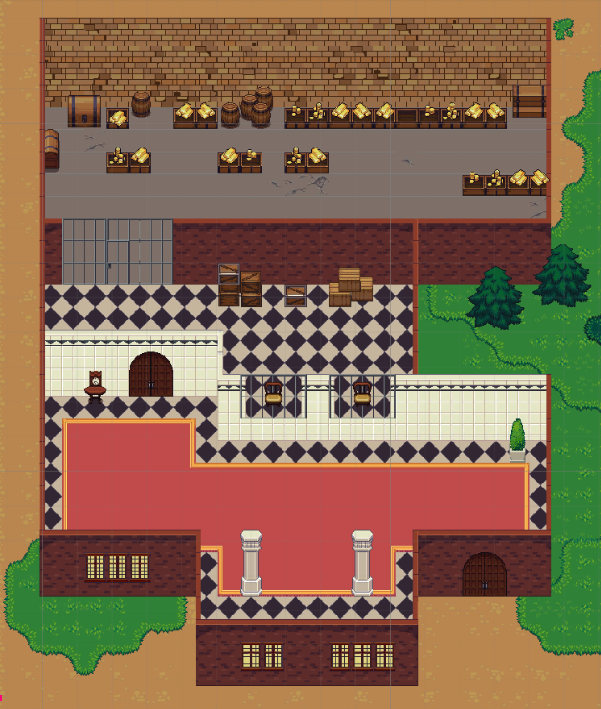
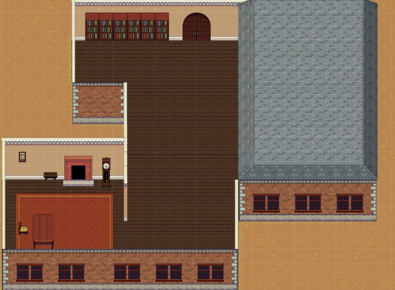
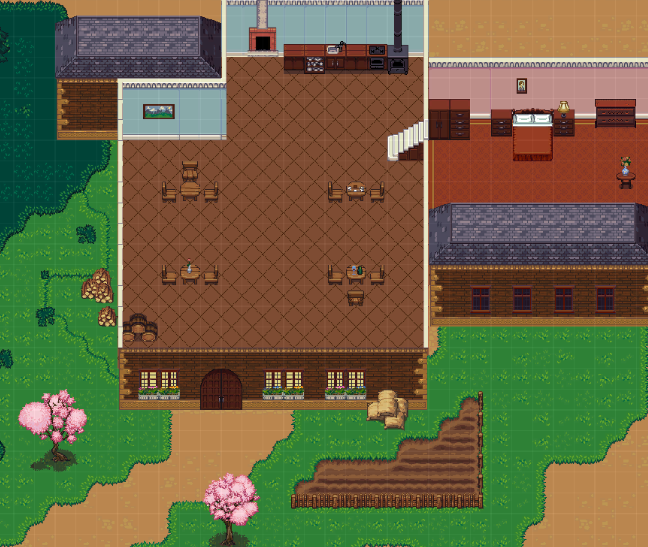
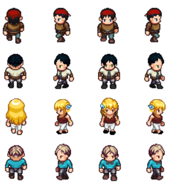
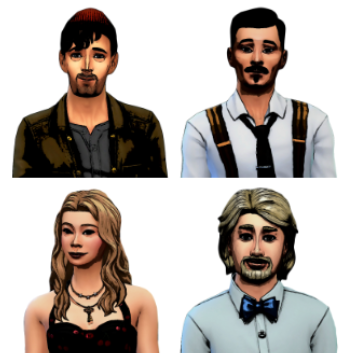
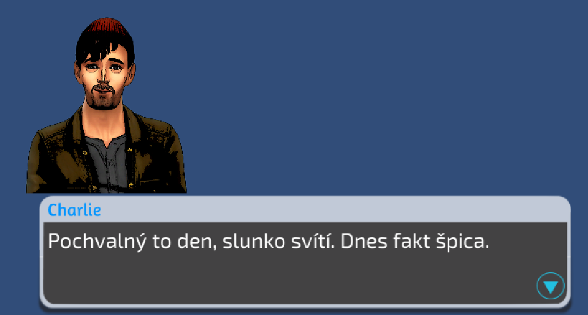

# Statický svět

Hra se začala utvářet kolem příběhu a pro tento příběh byly vytvořeny scény s objekty a postavami.

## Scény 
Byly vytvořeny scény, ve kterých se bude odehrávat začátek příběhu. Jedná se o banku, kancelář a restauraci.

Příklady krajinných objektů:
- balíky sena
- stromy
- zem (tráva, tmavší tráva, písek, záhonek, voda)

### Banka
Příklady objektů:
- zlato
- krabice
- hodiny
- sudy
- sloup

### Kancelar
Příklady objektů:
- knihovna
- obraz
- stůl
- krb
- koberec

### Restaurace
Příklady objektů:
- lampa
- postel
- květiny
- krb
- umyvadlo

## Dynamické objekty
Byly vytvořeny 4 postavy, které jsou dynamickými objekty - mohou se pohybovat. Jedná se o postavy, důležité pro příběh. Pro tyto postavy byly vypracovány a avatary, které budou zobrazeny u dialogů.

### Postavy

### Avatary k postavám

### Ukázka dialogu (v tomto případě monologu)

## Zdroj assetů

Odkazy na assety lze dohledat v následujícím dokumentu: https://docs.google.com/document/d/1SDCFm7Y3P5sCd-yiooQf_u0HExDKepfOwGlUJivuU-c/edit