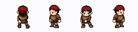
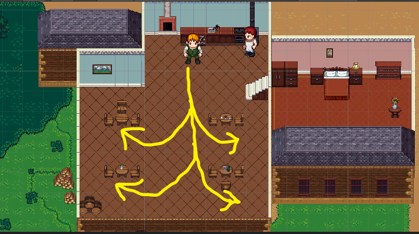
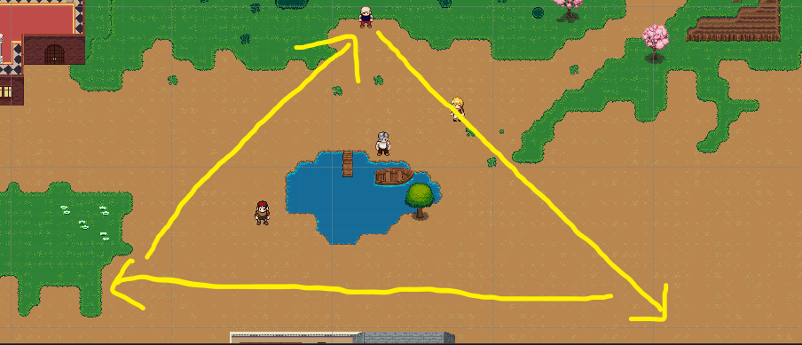
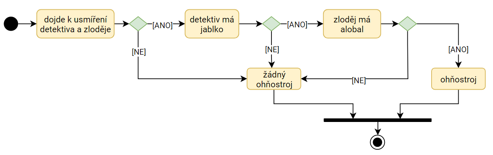
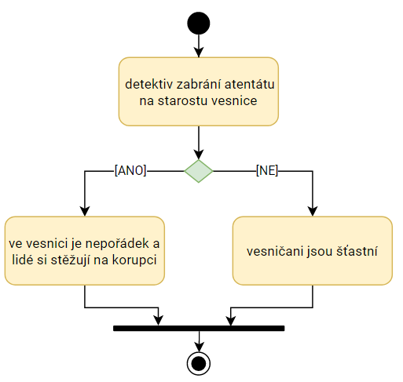
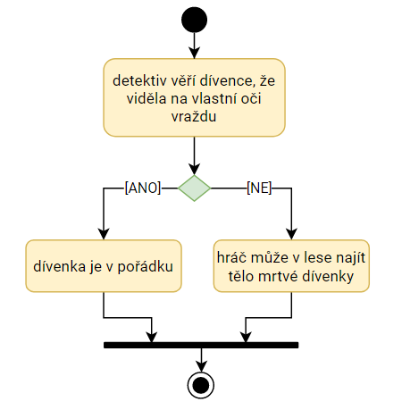
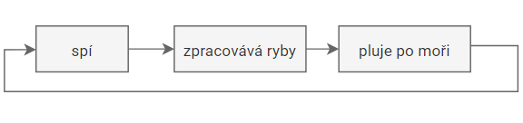
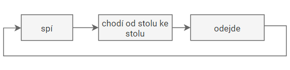
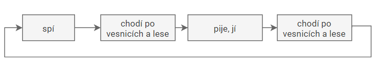
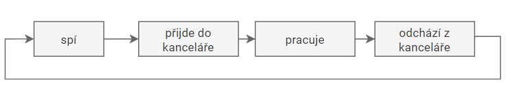

# Dynamický svět

Následující dokument popisuje přidání dynamiky do vytvořeného herního světa.

## Animace pohybu
- Každá postava má animace pohybu a rozlišuje mezi stavy chození / stání 
- **Bard** navíc hraje na kytaru.
- **Rváč** se navíc pere.
- **Charlie** se navíc pere.
  - 
  

## Cyklické činnosti - hotové:
- **Enrico Marino - rybář**
  - Chytá ryby -> Jde do restaurace -> prodá ryby -> vrátí se k jezeru -> Chytá ryby
  - -  
- **Číšník**
 - Čeká, až kuchař uvaří jídlo -> odnese jídlo ke stolu, který je právě na řadě -> vrátí se do kuchyně
 -  
  
- **Rváč**
    - Chodí dokola po mapě, chce se prát
    -  

  

## Cyklické činnosti - v plánu:
- **Tulák**
  - Spí -> chodí po vesnicích / v lese -> pije, jí -> chodí po vesnicích / v lese -> spí
- **Sekretářka**
  - Spí -> přijde do kanceláře -> pracuje -> odchází z kanceláře -> spí
  
## Produkce - hotová
- **Enrico Marino - rybář**
  - Ryby -> maso(suroviny) - rybář za 7.5 vteřiny uloví 5 ryb, které odnese do restaurace
- **Kuchař**
    - suroviny -> jídlo - kuchař potřebuje k vytvoření jídla 3 jakékoli suroviny. Když je má k dispozici, tak každých 5 vteřin uvaří jídlo
- **Číšník**
    - spotřebovává jídlo. Kdykoli je uvařené jídlo, odnese ho k jednomu ze stolů (kde zatím chybí hosté)
## Produkce - v plánu
- **Guiseppe Grezzo - kovář**
  - Ocel -> výrobky (lana, odlitky)

- **Farmář 1, Farmář 2**
  - pole -> obiloviny + zelenina (suroviny)

## Chování
- **Rváči**
  - Když s ním hráč interaguje, tak ho začne slovně napadat a konflikt může vyústit až v souboj
   - Je-li poražen, tak zemře a za chvíli zmizí z mapy
- **Všechny NPC**
  - pokud se je Charlie (zloděj) pokusí okrást, tak buď rovnou dostane peníze, nebo se budou bránit a bojovat
- **Vyšinutí lidé**
  - v přítomnosti Fillipa (detektiv) se lidé chovají podivně a vyšinutě - častují ho náhodnými výkřiky

## Unikáty
Unikátní jevy rozlišujeme na 2 typy. Jevy, které mají malou pravděpodobnost a nastanou tedy vyjímečně a jevy, které jsou silně podmíněny - a to činostmi hráče.

### Malá pravděpodobnost
- **Ohňostroj**
  - za předpokladu, že se detektiv a zloděj udobří a UFO je pozve k sobě na palubu a zloděj získá alobal a detektiv jablko
- **Daisy - reakce na vraždu**
    -Pokud hráč bude ignorovat hlavní úkol, místo toho se pustí do souboje s rváčem a zabije ho blízko Daisy, ta si toho všimne a bude reagovat.

### Silně podmíněno
- **Nájemný vrah**
  - ve vesnici je nepořádek a obavy, pokud detektiv zabrání atentátu na starostu vesnice
- **Malá holka**
  - v lese se objeví mrtvá dívenka, pokud jí detektiv nebude věřit, že viděla na vlastní oči vraždu (vrah ji zabije, aby se zbavil svědků)

## Diagram aktivit
Byl zakreslen diagram aktivit u unikátních činností a cyklických jevů.

| Objekt     | Diagram aktivit |
|------------|:---------------:|
| unikát1    |    |
| unikát2    |     |
| unikát3    |     |
| rybář      |       |
| číšník     |      |
| tulák      |       |
| sekretářka |  |
