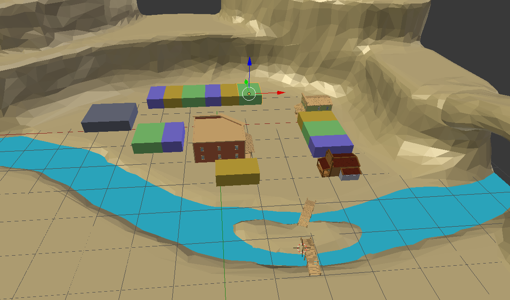
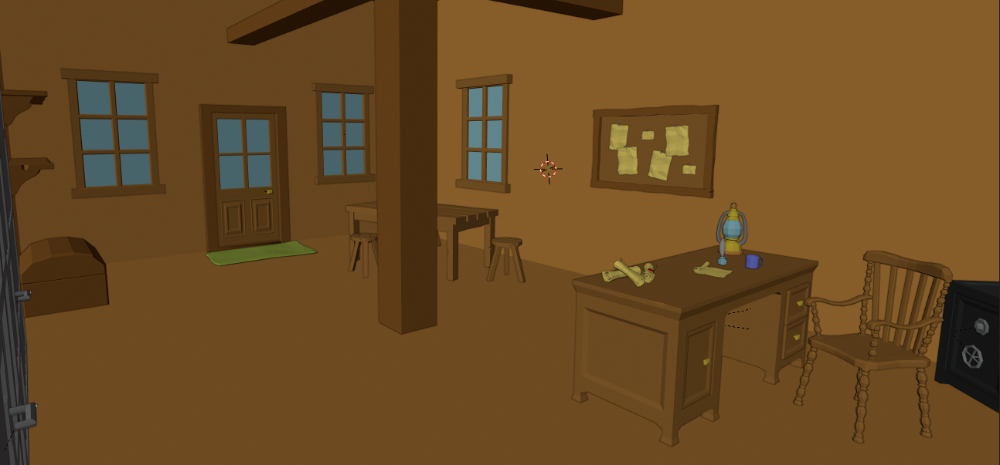
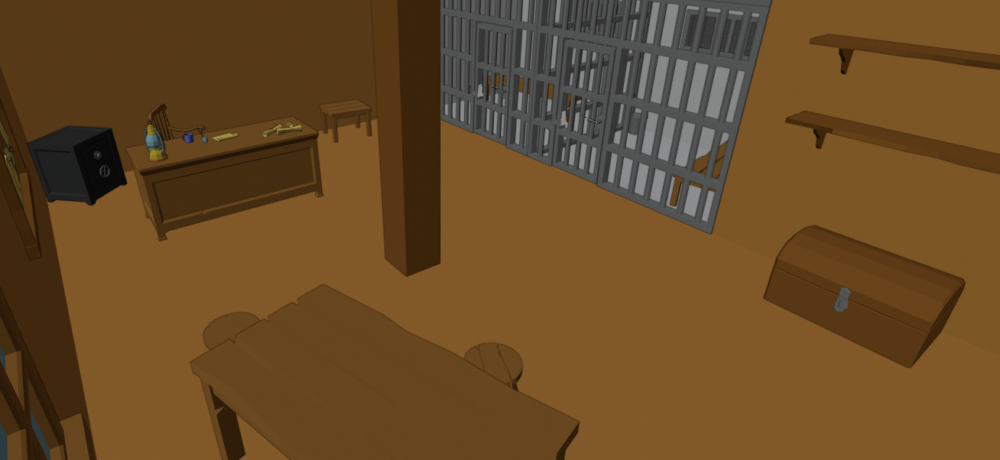
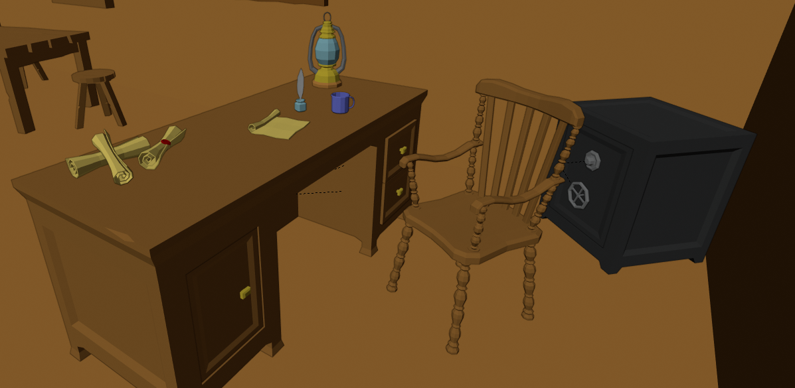
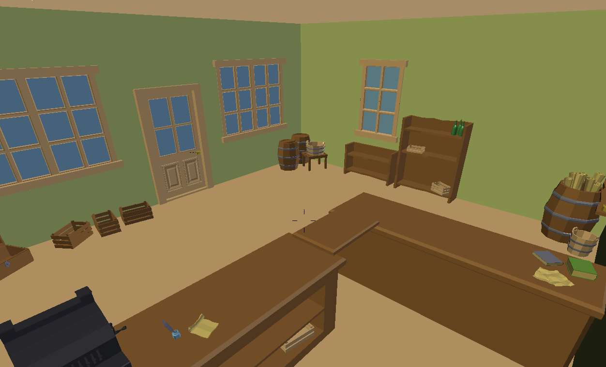
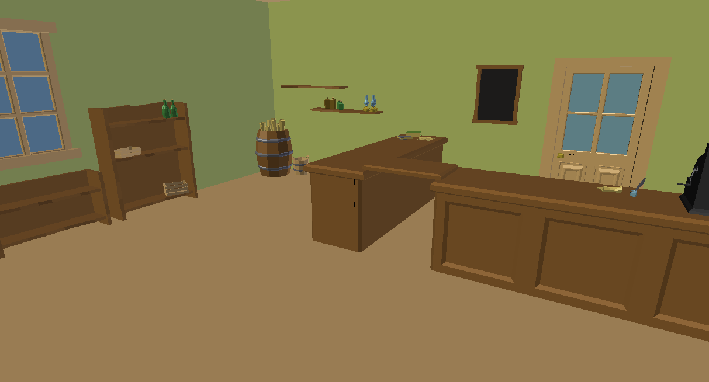
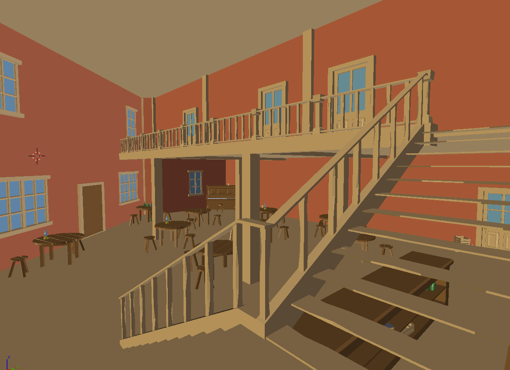
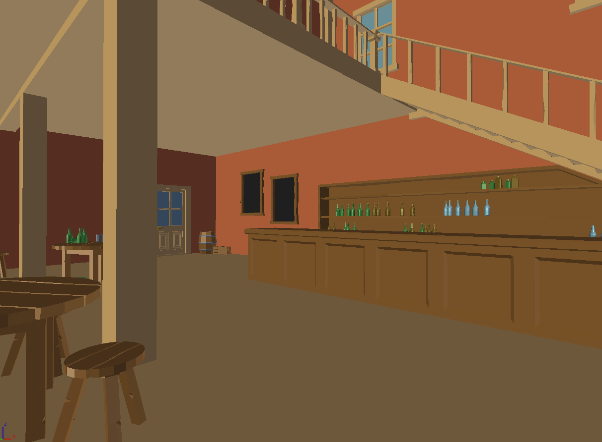
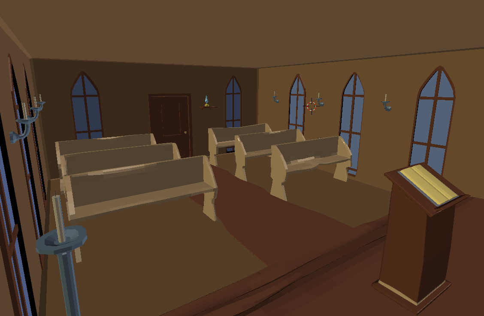
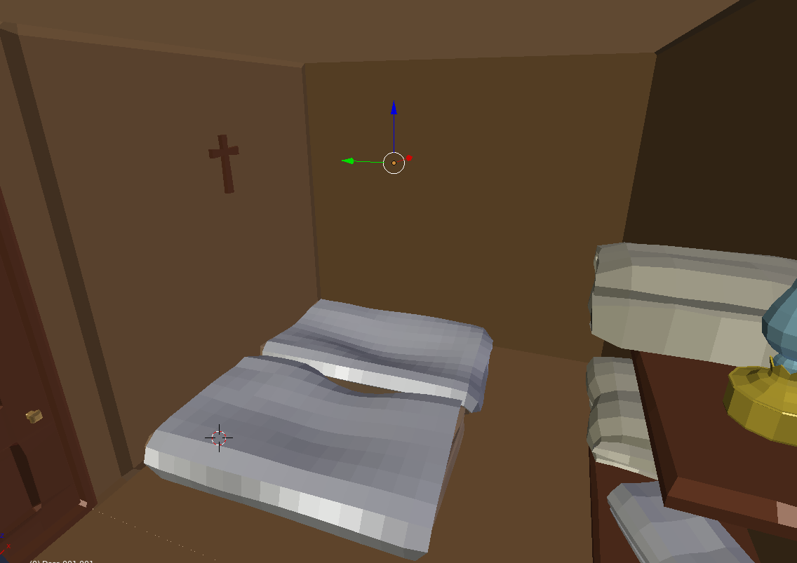

# Scenes
 - Outside world - village
 - Sheriff office
 - Saloon
 - General Store
 - Church
 
## Basic information
 - All objects in scenes are made in blender by our team
 - The textures in scenes will be implemented later
 - The list of objects used in scenes can be find at the end of this document

## Outside world
The main layer can be shown on the picture below. The object are the houses of villagers, or main houses with specific scenes such as saloon, sheriff office, etc. Between objects in the scene are the nature (for example cactuses, trees, ...), bridge, river, and mountains.

## Sheriff office
 On the beggining of game/story line the player will be shut in the cell and will be forced to co-operate with sheriff (because of that the player will be released). In the second cell is another prisoner - for more about story line take a look to story/dialogue directory.
 
 Much of the time the sheriff will be present in sheriff office or at the terrace of the same building except the specific events. Between these events belong night-sleep, lunch and on sunday when is time to go to church. 
 
 The another prisoner is shut in the cell all the time without any movement from sheriff office - the situation is changed, if the side quest from criminal is fulfilled.
 

## General store
In the scene can be find dealer. The general shop is located in house (with two floors), dealer lives in the second floor - the player hasn't access there.  

Much of the time the dealer will be present here (or at the terrace) except specific events (night-sleep, lunch time, sunday). 

## Saloon
In the scene can be find the barman and the protagonist can get alcohol for heal, get the side quests or buy the place for sleeping. The barman is the most of the time in the bar, and live in the bar too. 

## Church
In the scene can be find priest or the other villagers. In the building is located one small room which serve as the home for the priest (player doesn't have the permission go to this room). There is situated one more room in the church where the protagonist can sleep through night. 

## List of objects
The every object is created by members in team, nothing is imported from the internet. 

|  Type of object |       Name     | Scenes |Advanced information |
|-----------------|----------------|--------|-------------|
|  static object  |     windows    | Sheriff office, General Store, Church, Saloon | |
|                 |      door      | Sheriff office, General Store, Church, Saloon | |
|                 |      table     | Sheriff office. Saloon | |
|                 |      chairs    | Sheriff office, Saloon | |
|                 |      beam      | Sheriff office | |
|                 |      rug       | Sheriff office | |
|                 |     shelfs     | Sheriff office, General Store, Church | |
|                 |     scrolls    | Sheriff office, General Store | | 
|                 |      mug       | Sheriff office, Saloon | |
|                 | phial with ink | Sheriff office, General Store | |
|                 |     lantern    | Sheriff office, General Store, Church, Saloon | |
|                 |   iron bars    | Sheriff office | the two cells in sheriff office - contains latticed door, animation of opening |
|                 |     bench      | Sheriff office, Church | in cells |
|                 |    bucket      | Sheriff office | in cells |
|                 |  notice board  | Sheriff office , General Store | here the player can find the wanted posters ( used in side quests ) |
|                 |      chest     | Sheriff office, General Store | the object is prepared to animation of opening |
|                 |  paper/posters | Sheriff office, General Store | |
|                 |     crate      | General Store, Saloon | |
|                 |     barrel     | General Store, Saloon | |
|                 |   footstool    | General Store | |
|                 |      rack      | General Store, Saloon | |
|                 |     bottle     | General Store, Saloon | |
|                 |      book      | General Store, Church, Saloon | |
|                 |  cash register | General Store | |
|                 |  wooden bucket | General Store | |
|                 |     mattress   | Church | |
|                 |      sheets    | Church | |
|                 |      cross     | Church | |
|                 |   candle stick | Church | |
|                 |     board      | Saloon | |
|                 |      hat       | Saloon | |
|                 |     tree       | Outside | |
|                 |    cactus      | Outside | |
|                 | villager's houses | Outside | |
| unique objects  |  sheriff table | Sheriff office | |
|                 |  sealed scroll | Sheriff office | |
|                 |       safe     | Sheriff office | the object is prepared to animation of opening |
|                 |  sheriff chair | Sheriff office | |
|                 |     carpet     | Church | |
|                 | stand for book | Church | |
|                 |      piano     | Saloon | |
|                 |      bar       | Saloon | |
|                 |    bridge      | Outside | |
 