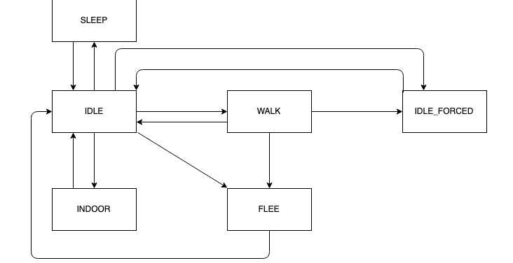
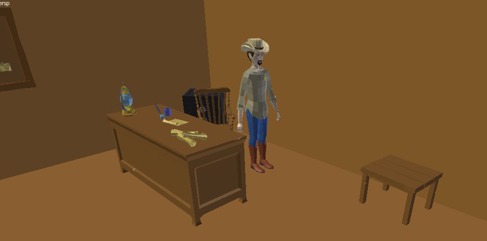
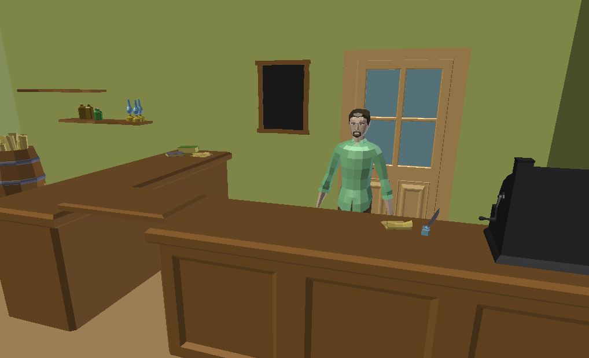
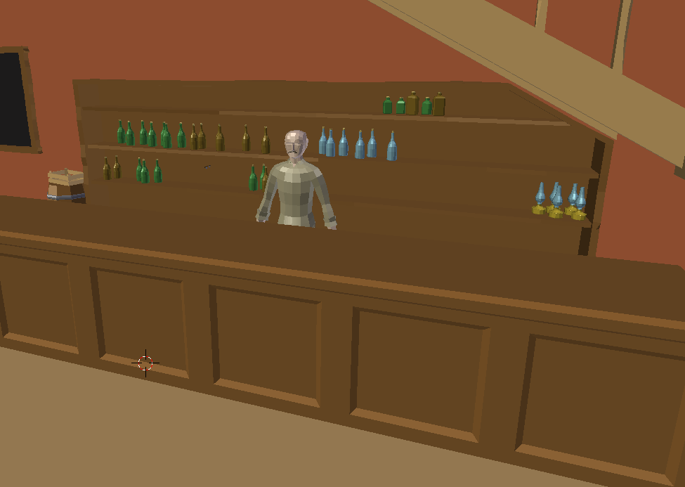
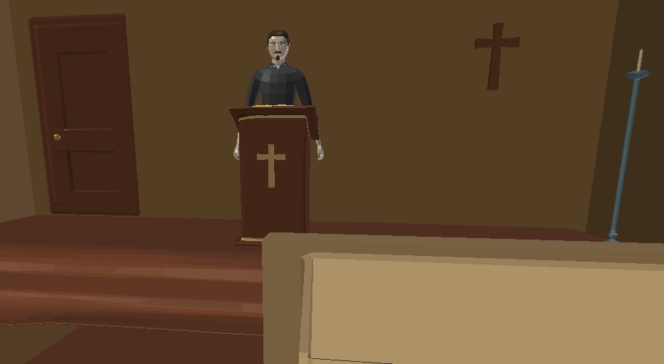
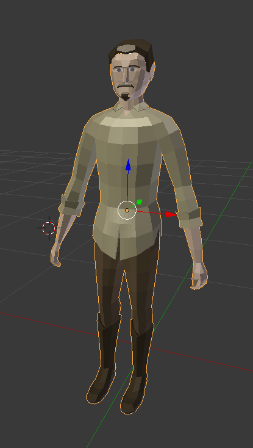
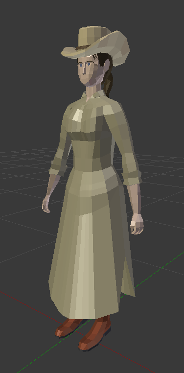

# Basic information
*  food in game is not resolved, the villagers will be eat in their house, where player doesn't have an access
*  system is set to 24 hours (1 hour lasts 50 seconds, one day lasts 20 minutes)
*  week has 7 days
*  bell in village will be ring at 7 AM, 12 AM, and 17PM

Warning: The characters in the document can be the different in the game. The characters are generated through "male generator" or "female generator" and are used in the game. So the body can be very similar or the same, but the color of the clothes and boot can be different.

# Animation
The graphics in game is low-poly and that's why the animation of villagers and protagonist are simplier. 

# Cyclic activities 
Between 11AM and 1PM the villagers go to the lunch to their own houses (where player doesn't have access). At the 11AM there is 30% chance, at the 12AM there is 70% and at the 1Pm there is 100% chance. Every villager has to go to the lunch through this time (if the villagers was at the lunch, after there is 0% chance to go to the lunch second time).

## General behaviour - graph

## Sheriff
*  At 8 AM the sheriff WALK to the his office
*  Between the time 8AM - 5PM, the sheriff will be in the office or outside on the terrace 
*  At 5 PM the sheriff WALK back to his home
*  On the sunday there is a 30% chance that sheriff will go to the church
*  During night/lunch there is 40% chance that sheriff will forget lock the door to the office

The most common activities is sitting or pace around the sheriff office, or sitting on the terrace in front of it. The sheriff is the old man so often he can forget the lock the door and some people can sneak in. The old man has some trics - he doesn't have to go in the village but he knows the movement of the bandits and that's why he can give the protagonist the proper information.

## Merchant
*  At the 8AM merchant enter to the shop (his house is in the same building, but the player has access only at the shop)
*  From 5PM to next day will be shop locked
*  After 5PM there is 40% chance that merchant will go to the village for walk
*  On the sunday there is 20% chance that merchant will go to the church
*  During night/lunch there is 100% chance that door will be locked

The merchant is quite different person with specific personality. He is hungry just for wealth and money. Because of this his only love is business. He is very careful and always lock the door, even if he is in the other part of the house (not in the shop). 

## Barman
*  At the 7AM goes to the saloon (from his room)
*  The saloon will be locked at 9PM
*  On the sunday there is 0% chance that barman will go to the church

The barman spend the most of his time on the bar and mix the drinks, or sell the alcohol. If he isn't in the saloon the protagonist can't find him anywhere, because he is "hidden" in his own room in that time. The movement of the barman is restricted in the saloon and possibility to meet him outside is minimal. 

## Priest
*  At the 10AM the priest enter to the church
*  During the time 10AM - 5PM there is 20% chance that priest will be in his room
*  During the time 8AM - 10AM he will be walking in the village
*  At the 5PM the priest leave the church
*  Church or room for sleeping (for player) is not locked
*  On the sunday the priest is at the church during the time 8AM-3PM
*  During the time 3PM-6PM on sunday there is 50% chance that priest is on the walk

## Villagers
* The general behaviour is leave from own houses during the time 7AM-9AM,
* enter to their houses during the time 4PM-20PM
* On the sunday there is 80% chance that villager will go to the church
* During the time 7AM-20AM they can be at the different positions: their house ( 10% ), saloon ( 25% ), church ( 20% ), shop ( 20% ), walking in the village ( 25% )

The villagers have the special action if in the village is action such as the attack by bandits, fire, or anything which can be dangerous for them. 

### Communication between player and villagers
1.  While player doesn't fulfil at lest 3 main quests, or his karma is below 30%, the villagers don't want to communicate with player
* "Let's go away from him. It's that man from wanted posters."
* "Sorry, I don't know anything." the fast apology and faster departure from protagonist
* "Please, don't hurt me. I haven't done anything to you."

2. Karma is beyond 30%
* "Thank you for guarding our village. How can I help you?"
* "Oh, it's you. I see you a few times ago helping some villagers. What do you want to know?"
* "What it is? I will answer you if I can?"
* "Sorry, I don't have a time."
* "I have to work. I can't help you."

3. Questions from player to villagers:
* "Where is sheriff office?"
* "Where is the saloon?"
* "Where is the general shop?"
* "Where I can stay overnight?"
* "How can I leave this place?"

## Bandits
* appear after acceptance of main/side quest
* in special cases (such as the main last quest - but the protagonist don't accept the quest)
* they can wander in the village road or attack the villagers (the second action is connected almost every time with quest - such as save the villager) 

## Wanted criminals
* appear only in case, where the player accept side quest (catch the wanted criminal)
* they wander in the village road 
* The level of the criminal is chosen with the acceptance of the test - if the criminal is not a big fish, the protagonist can have a chance to convince him surrender, in the other case the criminal has to be killed or beaten 