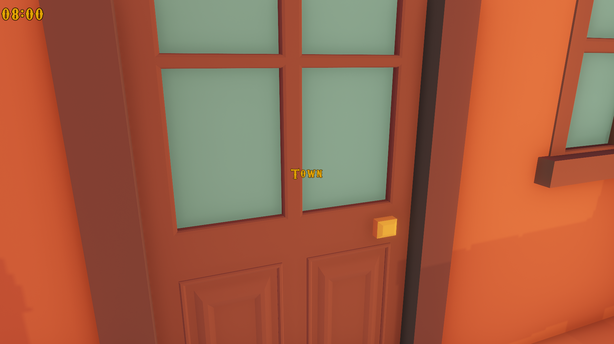

# Dialogues   

## The basic principles of the dialogue
The player can interact with the main characters (sheriff, barman, merchant, priest), common villagers or sometimes with bandits. After interaction the all unlocked possibilities will be displayed. The player can choose one of them and the answer from the character will be shown on the screen. When the player wants to communicate with characters, the dialogues are different. 
*  villagers: the villager can answer just the basic information such as position of building
*  main characters: the player can asks about main/side quests, about other people in village or bandits
*  bandits: the main topic for conversation is convince the criminal leave the village

## Complex dialogues
After interaction with one of the main characters the right question is chosen (and the situation of the world is optimal), the player can find out useful information. Almost all the main information are known by sheriff. 
*  if the player choose not cooperate with sheriff, he won't be release from the prison and the main story will end
*  if the player decide the save his brother in the end of the story, the fiancé will die and the other way around
*  etc.

## Tasks
The tasks are divided into main/side. Main tasks can be accepted almost everytime in the sheriff office. Sheriff has information about all activities of bandits and that's why he can intervene at the right time. The side quest are accepted from the posters in sheriff office (catch the wanted criminal) or in the saloon from barman. On top of that the player can find the accepted quests in the "diary", which is displayed with shortcut. 

## Scenes
The scenes are divided everytime with door. When player wants to change the scene, he has to approach the right door and the text with name of scene will be shown. 

-- the more specific information about main story can be found here: [main story](https://gitlab.fit.cvut.cz/BI-VHS/b201projects/sedm-statecnych/tree/master/Story%20and%20dialogs)